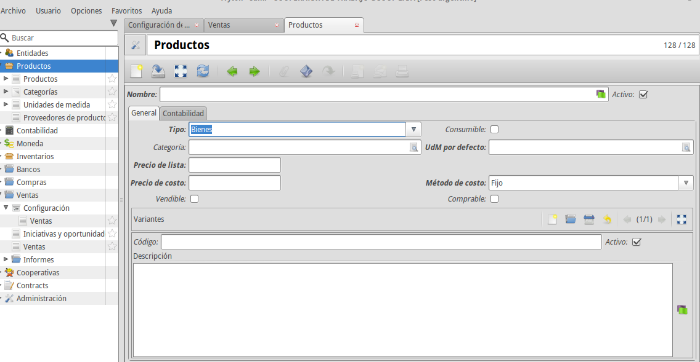
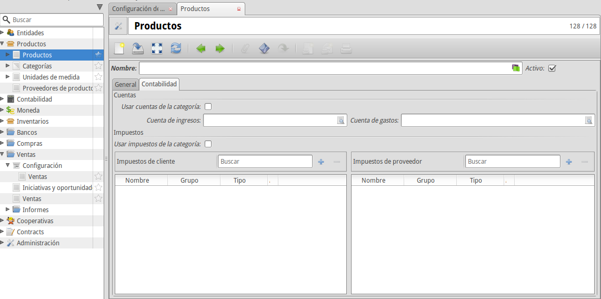

Productos
=========

El concepto producto en Tryton está compuesto de dos modelos: la plantilla de producto y la variante del producto. Esta separación se usa para poder definir un producto genérico (plantilla) y las diferentes tipologías que pudieran haber de este producto (variante). Podemos tener tantas variantes de una plantilla como queramos y cada plantilla tendrá como mínimo una variante. Esto se debe a que, en nuestra gestión, los procesos (venta, producción, compra, amortización, etc.) los realizaremos siempre sobre la variante, nunca sobre la plantilla, por lo que cada plantilla necesitará como mínimo una variante.

Poniendo como ejemplo la venta de camisetas, la plantilla del producto podría ser “Camisq marca X” y una de sus variantes “Camiseta marca X talle L”. Tendremos tantas variantes como talles tengamos, pero solo una plantilla para este producto: “Camiseta marca X”. En caso de que solo tengamos una talla para este tipo de camiseta, tendríamos la misma plantilla, pero solo una variante.

Crear un producto nuevo
-----------------------

El primer paso para crear un producto desde cero es crear una plantilla de producto. Para ello accederemos al menú Productos / Plantillas de producto y, haciendo clic en Nuevo, se nos abrirá el formulario de edición de la plantilla. En este formulario deberemos especificar los campos Nombre, Tipo (indicando si se trata de un bien, un servicio o un activo), el Precio de venta, el Precio de coste, el Método de coste (que veremos a continuación más detenidamente) y la UdM por defecto (donde indicaremos la medida que utilizaremos para cuantificar el producto). Además, si lo deseamos, le podemos indicar una Categoría para agrupar el producto que estamos creando con otros de similar tipología.

Si seleccionamos en el campo Tipo la opción Bienes, nos aparecerá también el campo Consumible, que debemos marcar si queremos que no se controle el número de existencias de nuestro producto. En caso de dejarlo sin marcar el sistema llevará un control de la cantidad que tengamos de este producto.

En caso de que queramos que el producto este disponible para las compras, debemos marcar el campo Comprable. Una vez marcado nos aparecerá una nueva pestaña Proveedores, dónde podremos definir la UdM de compra, en caso de que sea distinta de la UdM por defecto. Ademas podemos definir los Proveedores que nos subministran este producto, junto con el Nombre y el Código propios del Proveedor.

En la pestaña *Contabilidad* podremos especificar la configuración contable del producto, pudiendo especificar la Cuenta de ingresos y la Cuenta de gastos. Además podremos indicar también qué impuestos se aplicarán por defecto al producto al venderlo, en el campo Impuestos de cliente, y al comprarlo, en el campo Impuestos de proveedor. Por ejemplo, podríamos utilizar los siguientes valores para estos campos:

* Cuenta de ingresos: 700000 - Ventas de mercaderías.
* Cuenta de gastos: 600000 - Compras de mercaderías.
* Impuestos de cliente: IVA 21%
* Impuestos de proveedor: 21% IVA Soportado (operaciones corrientes)

Para simplificar la configuración contable de los productos, podemos marcar los campos Usar cuentas de la categoría y Usar impuestos de la categoría para que se le aplique al producto la Cuenta de ingresos, la Cuenta de gastos, los Impuestos de cliente y los Impuestos de proveedor definidos en la Categoría del producto que hayamos seleccionado en la pestaña anterior. 

